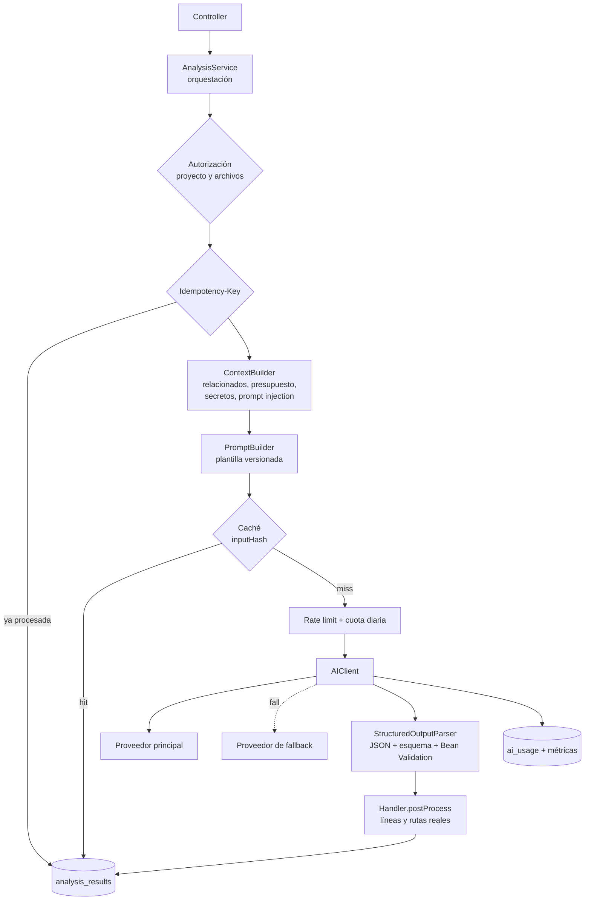
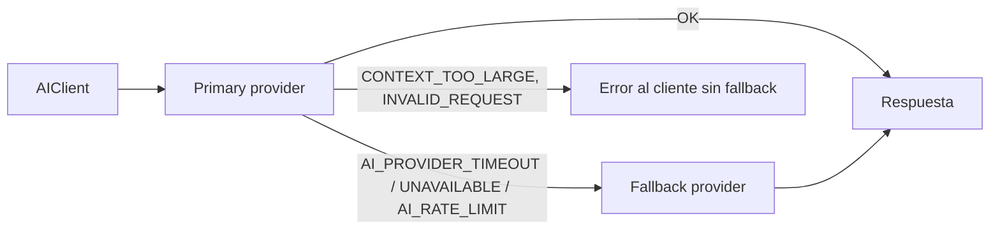
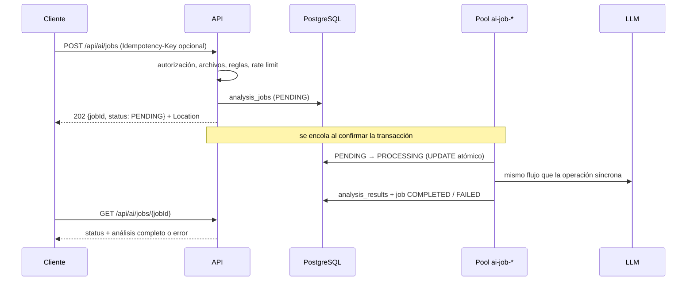

# Arquitectura de IA

Este documento explica cómo se integra el LLM en la aplicación y por qué se tomó cada decisión. El
objetivo es que la IA sea una pieza más del backend, con contratos, límites, validación y trazabilidad.
No se trata de un endpoint que reenvía texto a un modelo.

## Índice

1. [Visión general](#1-visión-general)
2. [Integración con el LLM](#2-integración-con-el-llm)
3. [Abstracción del proveedor y fallback](#3-abstracción-del-proveedor-y-fallback)
4. [Gestión de prompts](#4-gestión-de-prompts)
5. [Gestión de contexto](#5-gestión-de-contexto)
6. [Salidas estructuradas y validación](#6-salidas-estructuradas-y-validación)
7. [Procesamiento asíncrono](#7-procesamiento-asíncrono)
8. [Idempotencia](#8-idempotencia)
9. [Caché](#9-caché)
10. [Consumo, costes y métricas](#10-consumo-costes-y-métricas)
11. [Conversaciones](#11-conversaciones)

## 1. Visión general



Paquetes (`com.samsenpro.aiassistant.ai`):

| Paquete | Responsabilidad |
|---|---|
| `provider` | `AIProvider` (contrato), `OpenAICompatibleProvider` (Spring AI), `AIClient` (fallback, uso, métricas), infraestructura HTTP |
| `prompt` | `PromptTemplate`, `PromptService` y `PromptBuilder`; plantillas en `src/main/resources/prompts/` |
| `context` | `ContextBuilder`, `RelatedFileFinder`, `CodeOutline`, `SecretRedactor`, `PromptInjectionDetector`, `TokenEstimator` |
| `parser` | `StructuredOutputParser` e `InvalidAIResponseException` |
| `analysis` | `AnalysisService` (orquestación), un `OperationHandler` por operación, DTOs de resultado, caché y persistencia |

Regla de oro: **ninguna transacción de base de datos queda abierta mientras se espera al LLM**. Cada
escritura (reservar la idempotency key, guardar el resultado, registrar el consumo) es corta e
independiente.

## 2. Integración con el LLM

La única integración real es `OpenAICompatibleProvider`, construida sobre el `ChatModel` de **Spring AI
1.1** (la línea compatible con Spring Boot 3.x). Habla con cualquier API compatible con la de OpenAI, así
que para cambiar de proveedor basta con configurar tres variables:

| Proveedor | `AI_BASE_URL` | `AI_MODEL` |
|---|---|---|
| Ollama (local, perfil `ollama`) | `http://ollama:11434` | `qwen2.5-coder:3b` |
| OpenAI | `https://api.openai.com` | `gpt-4o-mini` |
| Groq, OpenRouter, DeepSeek… | URL del proveedor | modelo del proveedor |

La API key llega siempre por la variable de entorno `AI_API_KEY` y nunca aparece en el código ni en los
logs.

La aplicación sustituye tres beans de Spring AI (`AIProviderConfig`):

- **Timeouts explícitos** (`AI_TIMEOUT`, conexión 5 s). Ninguna llamada puede quedarse colgada.
- **Reintentos acotados**. Por defecto Spring AI reintenta 10 veces con un backoff de hasta 3 minutos,
  algo inaceptable en una petición síncrona. Aquí son 2 intentos y solo ante errores 5xx o fallos de
  conexión. Un timeout no se reintenta, porque duplicaría la espera del usuario.
- **Errores HTTP tipados**. 429, otros 4xx y 5xx llegan como excepciones con el código de estado como
  dato y se traducen al contrato de errores de la API.
- **HTTP/1.1 forzado**. El cliente del JDK intenta h2c sobre `http://`, y muchos servidores compatibles y
  proxies cortan esa conexión. Se detectó con los tests de WireMock.

Mapeo de fallos del proveedor:

| Situación | Código de la API | HTTP |
|---|---|---|
| Sin respuesta dentro de `AI_TIMEOUT` | `AI_PROVIDER_TIMEOUT` | 504 |
| 5xx tras reintentos, conexión rechazada, 401/403/404 (configuración) | `AI_PROVIDER_UNAVAILABLE` | 503 |
| 429 del proveedor (con `Retry-After` si lo envía) | `AI_RATE_LIMIT` | 429 |
| 400 por contexto excedido | `CONTEXT_TOO_LARGE` | 413 |
| Respuesta vacía, truncada, no JSON o fuera de esquema | `INVALID_AI_RESPONSE` | 502 |

Tokens: si el proveedor informa del consumo (`usage`), se usa ese dato. Si no lo informa (algunos
compatibles no lo hacen), se estima y se marca `tokensEstimated=true` en `ai_usage`, para que las cuotas
sigan teniendo efecto.

## 3. Abstracción del proveedor y fallback

```java
public interface AIProvider {
    String name();                                 // "openai", "ollama"... (tag de métricas)
    String model();
    AIResponse generate(AIPrompt prompt);          // texto libre (conversaciones)
    AIResponse generateStructured(AIPrompt prompt); // JSON (modo nativo del proveedor si existe)
}
```

- Los controllers y servicios no conocen Spring AI. Solo `OpenAICompatibleProvider` lo importa.
- Para añadir un proveedor con API propia (por ejemplo, la API nativa de Gemini) hay que implementar
  `AIProvider` como bean y referenciarlo por su nombre en `ai.provider.primary` o `ai.provider.fallback`.
- **El fallback vive en `AIClient`**:



Solo se prueba el fallback ante fallos *del proveedor* (`ErrorCode.isProviderFailure()`). Un contexto
demasiado grande o una petición inválida fallarían igual en otro proveedor, así que no tiene sentido
reintentarlos allí. Cada intento se registra en `ai_usage` y en las métricas con el nombre del proveedor
que lo atendió.

Hoy existe un único proveedor real y el fallback queda desactivado (`AI_FALLBACK_PROVIDER` vacío). La
lógica está probada con dos proveedores simulados (`AIClientTest`). Activarla en producción sería
cuestión de configuración, por ejemplo OpenAI como principal y un Ollama interno como reserva.

## 4. Gestión de prompts

Los prompts **no están en el código**. Cada operación tiene su plantilla versionada:

```text
src/main/resources/prompts/
├── explain.txt          ├── tests.txt
├── review.txt           ├── documentation.txt
├── improve.txt          ├── error-analysis.txt
└── chat.txt
```

Formato:

```text
# id: review
# version: 1.0.0
=== SYSTEM ===          → mensaje de sistema (reglas; nunca contiene datos del usuario)
=== CONTEXT ===         → proyecto, archivos incluidos y cómo, avisos de seguridad
=== SOURCE CODE ===     → bloques de datos no fiables con números de línea
=== USER REQUEST ===    → instrucciones opcionales del usuario, también como datos
=== TASK ===            → qué hacer
=== OUTPUT FORMAT ===   → estructura JSON exacta
```

- `PromptService` carga y valida todas las plantillas **al arrancar**. Una plantilla rota impide el
  arranque en lugar de fallar en la primera petición.
- `PromptTemplate` sustituye las variables `{{nombre}}` **en una sola pasada**. Si el código del usuario
  contiene `{{algo}}` o `$1`, se inserta literal.
- `PromptBuilder` compone el `AIPrompt` y rechaza con `CONTEXT_TOO_LARGE` cualquier prompt por encima de
  `AI_MAX_PROMPT_TOKENS`. Es la última barrera antes de gastar tokens.
- La **versión** de la plantilla se guarda con cada resultado (`prompt_version`) y forma parte del hash de
  caché. Cambiar un prompt invalida automáticamente los resultados cacheados con la versión anterior.

## 5. Gestión de contexto

`ContextBuilder` decide qué código ve el modelo sin superar el presupuesto de tokens
(`AI_MAX_SOURCE_TOKENS`, 12 000 por defecto).

### Selección de archivos relacionados

`RelatedFileFinder` sigue las referencias desde los archivos seleccionados:

```text
UserController.java ──usa──▶ UserService.java ──usa──▶ UserRepository.java
   PRIMARY (0)                  RELATED (1)               RELATED (2)
```

Un archivo está relacionado si su nombre sin extensión aparece como palabra completa en el código:
tipos en Java/TypeScript, módulos en Python (`from app.user_service import`) o en JavaScript
(`require('./user-store')`). Es un heurístico léxico, sin compilar ni resolver imports: barato,
independiente del lenguaje y suficiente para elegir contexto. Se ignoran los nombres genéricos (`index`,
`utils`…), los candidatos se ordenan por profundidad y por número de referencias, y el total se limita a
`max-related-files` (5) y `related-depth` (2).

### Estrategia cuando el contenido no cabe

1. **Estimar**. `TokenEstimator` calcula caracteres / 3,5, redondeando hacia arriba. Es independiente del
   proveedor; un tokenizador exacto ataría la aplicación a un modelo. El valor es conservador para
   código, que produce más tokens por carácter que la prosa.
2. **Archivos seleccionados**. Van siempre completos: son lo que el usuario pidió analizar.
3. **Seleccionar relevantes**. Los archivos relacionados entran completos mientras quede presupuesto.
4. **Resumir**. Si un relacionado no cabe completo, entra como **outline**: imports, declaraciones y
   firmas con sus números de línea originales (`CodeOutline`). Al modelo le basta saber qué ofrece una
   dependencia, no cómo la implementa. El resumen es determinista, gratuito y sin latencia; se descartó
   resumir con el propio LLM porque costaría una llamada extra por archivo.
5. **Omitir**. Si tampoco cabe el outline, el archivo se omite y se avisa en `warnings`.
6. **Dividir (split)**. Si los archivos seleccionados no caben y la operación lo admite (REVIEW), se
   dividen en partes: archivos completos cuando caben, y los grandes por rangos de líneas cortando
   preferentemente en una línea en blanco y conservando la numeración original. Cada parte se revisa por
   separado y `ReviewHandler.merge` combina los hallazgos sin duplicados. El límite es `max-chunks` (4).
   Las demás operaciones necesitan ver el código entero para ser coherentes (una explicación o un código
   mejorado no se pueden "sumar" por partes), así que responden `CONTEXT_TOO_LARGE` indicando los tokens
   estimados y el límite.

La respuesta de cada análisis incluye `contextFiles`: qué archivos vio el modelo, con qué rol (`PRIMARY` o
`RELATED`) y en qué modo (`FULL`, `OUTLINE`, `PARTIAL` u `OMITTED`).

### Formato del código enviado

```text
<<<FILE id=ctx-3f9a1c2b7d4e path="src/UserService.java" language=JAVA role=PRIMARY content=FULL lines=1-42>>>
  1 | package com.shop;
  ...
<<<END FILE id=ctx-3f9a1c2b7d4e>>>
```

Cada línea lleva su número real, así el modelo puede citar líneas exactas y la aplicación puede
validarlas. El `id` del bloque se explica en [ai-security.md](ai-security.md#1-prompt-injection).

## 6. Salidas estructuradas y validación

Cada operación tiene un DTO de resultado (`ExplanationResult`, `ReviewResult`, `ImprovementResult`,
`TestGenerationResult`, `DocumentationResult`, `ErrorAnalysisResult`). No se asume que el LLM devuelva
JSON válido. La capa de validación es:

```text
LLM → respuesta en bruto → extracción del JSON → parseo → campos inesperados → DTO → Bean Validation
    → handler.postProcess (datos reales) → respuesta de la API
```

| Caso | Tratamiento |
|---|---|
| JSON válido | DTO validado |
| JSON envuelto en ```` ```json ```` o con texto alrededor | Se extrae el objeto más externo |
| JSON inválido | `INVALID_JSON`: se reintenta una vez y después 502 `INVALID_AI_RESPONSE` |
| Respuesta truncada (`finish_reason=length`) | `TRUNCATED_RESPONSE`, sin reintento (se repetiría igual) |
| Respuesta vacía | `EMPTY_RESPONSE` |
| Campos obligatorios ausentes o valores inválidos | `SCHEMA_VIOLATION` con la lista de violaciones |
| Campos inesperados | Se descartan (no llegan al cliente), se registran y se avisa en `warnings` |
| Listas opcionales ausentes | Se normalizan a listas vacías |
| Categoría desconocida en una review | `OTHER` (se conserva el hallazgo); una severidad desconocida invalida la respuesta |
| Timeout o error del proveedor | Código específico (sección 2) |

La respuesta inválida se reintenta hasta `AI_STRUCTURED_ATTEMPTS` (2) veces, porque con temperatura
mayor que 0 la siguiente suele ser distinta. Todos los intentos cuentan en `ai_usage` (los inválidos con
estado `INVALID_RESPONSE`), porque consumieron tokens. Si no se consigue una respuesta válida, el análisis
queda `FAILED` en el historial y el cliente recibe un error controlado **sin el texto del modelo**.

Validación contra la realidad (`OperationHandler.postProcess`):

- **Review**. Una línea fuera del rango real del archivo se sustituye por `null`, y un archivo que no se
  envió al modelo pierde su ubicación. En ambos casos se avisa. **La IA no puede inventar líneas.** Las
  rutas abreviadas (`UserService.java`) se resuelven a la ruta real si no hay ambigüedad.
- **Improve, tests y documentación**. Se eliminan los prefijos de número de línea que el modelo a veces
  copia del prompt y el bloque de Markdown que envuelve el código.
- **Tests**. Valores como `"none"` o `"none detected"` se normalizan a `null`.

## 7. Procesamiento asíncrono



- Las validaciones se hacen **al crear el job**. Un archivo ajeno o un rate limit se rechazan en el
  momento, no minutos después.
- El job se encola con `@TransactionalEventListener` (después del commit). El hilo del job siempre lo
  encuentra en la base de datos.
- `claim` es un `UPDATE ... WHERE status = 'PENDING'`, así que un job nunca se ejecuta dos veces.
- El pool es pequeño (2-4 hilos, cola de 50), porque la concurrencia real la limita el proveedor. Si la
  cola se llena, el job termina en `FAILED` en lugar de quedarse pendiente para siempre.
- El correlation ID de la petición que creó el job se guarda y se restaura en el hilo del job, así que
  sus logs se encuentran con el mismo ID.
- **Recuperación al arrancar**: los jobs `PENDING` se vuelven a encolar. Los `PROCESSING` pasan a
  `FAILED`, porque no se sabe si la llamada al LLM llegó a hacerse y repetirla sin saberlo podría gastar
  dos veces.
- Límite de jobs activos por usuario (`max-pending-jobs`, 5).

## 8. Idempotencia

Las operaciones de IA y los jobs aceptan la cabecera `Idempotency-Key`:

| Situación | Resultado |
|---|---|
| Primera vez | Se procesa; la clave queda reservada en la BD (índice único parcial `user_id, idempotency_key`) |
| Misma clave y misma petición, ya completada | Se devuelve el resultado guardado (`replayed: true`), sin llamar al LLM |
| Misma clave, todavía en proceso | 409 `IDEMPOTENCY_REQUEST_IN_PROGRESS` |
| Misma clave con otra petición | 422 `IDEMPOTENCY_KEY_REUSED` (se compara la huella SHA-256 de la petición normalizada) |
| Misma clave tras un fallo | Se reintenta reutilizando la fila |
| Dos peticiones simultáneas con la misma clave | La restricción única decide: una se procesa y la otra recibe 409 |

La clave se reserva **después** de comprobar el rate limit y la cuota. Una petición rechazada con 429 no
deja la clave bloqueada.

## 9. Caché

```text
petición → inputHash = SHA-256(proveedor:modelo, versión del prompt, proyecto, prompt exacto)
        → nivel 1: Spring Cache (Caffeine, 1.000 entradas, 1 h)
        → nivel 2: analysis_results en PostgreSQL (resultados COMPLETED de los últimos AI_CACHE_TTL = 7 días)
        → llamada al LLM
```

- **Cuándo se reutiliza**: misma operación, mismos archivos con el **mismo contenido**, mismos parámetros
  e instrucciones, mismo modelo y misma versión de prompt, para el **mismo usuario**.
- No hace falta invalidar nada. Si un archivo cambia, cambia el prompt y por tanto el hash. Lo mismo pasa
  al cambiar de modelo o de versión de plantilla.
- Un acierto de caché crea igualmente una entrada en el historial (`cached: true`, `sourceResultId`, 0
  tokens) y **no consume rate limit ni cuota**.
- `Cache-Control: no-cache` fuerza un análisis nuevo.
- Redis no se añadió: con una instancia, el nivel 1 solo evita una consulta indexada, y los resultados ya
  persisten en PostgreSQL. Con varias réplicas, el nivel 2 ya es compartido.
- Las conversaciones no se cachean, porque cada pregunta depende del historial.

## 10. Consumo, costes y métricas

Cada llamada al proveedor, con éxito o no, genera una fila en `ai_usage` con usuario, proyecto, operación,
proveedor, modelo, tokens de entrada, salida y total, duración, estado y código de error. **No se guarda
el prompt ni la respuesta**, que pueden contener código o datos sensibles.

`AIUsageService` aplica, por este orden:

1. **Rate limit** (token bucket de Bucket4j por usuario y operación, configurable por operación). Evita
   ráfagas accidentales, como un bucle en un cliente.
2. **Cuotas diarias** (día UTC, calculadas sobre `ai_usage`): tokens por usuario, peticiones por usuario y
   peticiones por operación. Antes de llamar se estima el coste de la petición (tokens del prompt más la
   salida máxima). Si no cabe en lo que queda de cuota, se rechaza sin gastar nada.

Un rechazo devuelve 429 con un mensaje claro, el motivo (`USER_RATE_LIMIT`, `DAILY_TOKEN_LIMIT`,
`DAILY_REQUEST_LIMIT`, `DAILY_OPERATION_LIMIT`, `TOO_MANY_PENDING_JOBS`), el límite, lo consumido y la
cabecera `Retry-After`. Todos los límites se cambian por configuración.

Métricas Micrometer (Prometheus en `/actuator/prometheus`), **solo con tags de baja cardinalidad**
(`operation`, `provider`, `status`, `error`, `type`, `result`, `reason`). Nunca `userId`, `projectId` ni
`conversationId`:

| Métrica | Descripción |
|---|---|
| `ai_requests_total` | Llamadas al proveedor por operación, proveedor y estado |
| `ai_requests_failed_total` | Fallos por tipo de error |
| `ai_request_duration_seconds` | Latencia (histograma) |
| `ai_tokens_used_total` | Tokens de entrada y salida |
| `ai_cache_requests_total` | Aciertos y fallos de caché |
| `ai_rate_limited_total` | Peticiones rechazadas por límites, por motivo |
| `ai_prompt_injection_suspected_total` | Contenido con posibles instrucciones para el modelo |
| `ai_jobs_total`, `ai_jobs_queued`, `ai_jobs_running` | Jobs terminados, en cola y en ejecución |

Además, Spring AI publica sus propias observaciones (`gen_ai_client_*`), y Actuator publica las métricas
HTTP (`http_server_requests_seconds`). El formato de logs y el correlation ID (`X-Correlation-ID`) son los
mismos que en observability-platform.

## 11. Conversaciones

Cada pregunta se responde con tres fuentes de contexto:

- **Información del proyecto**: nombre, descripción y lenguaje.
- **Archivos**: los elegidos al crear la conversación más los que se añadan a la pregunta, con sus
  relacionados, a través del mismo `ContextBuilder`.
- **Historial**: `HistoryWindow` envía los mensajes más recientes que caben en `history-token-budget`
  (3 000 tokens, como máximo 20 mensajes), en orden cronológico, e indica al modelo cuántos se omitieron.
  No se envía siempre la conversación completa. Se descartó resumir los mensajes antiguos con el LLM por
  el coste y la latencia extra; en conversaciones sobre código, la pregunta suele depender de los últimos
  intercambios y de los archivos, que se envían aparte.

La llamada al modelo se hace fuera de transacción. Los dos mensajes (pregunta y respuesta) se guardan
juntos al final, así que si el proveedor falla no queda media conversación.
